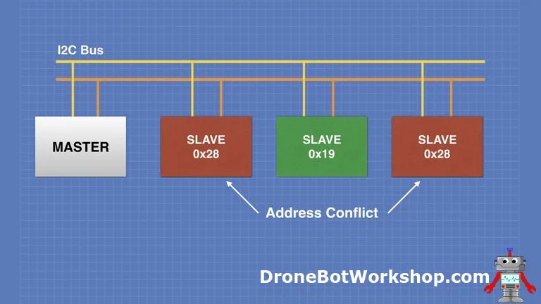
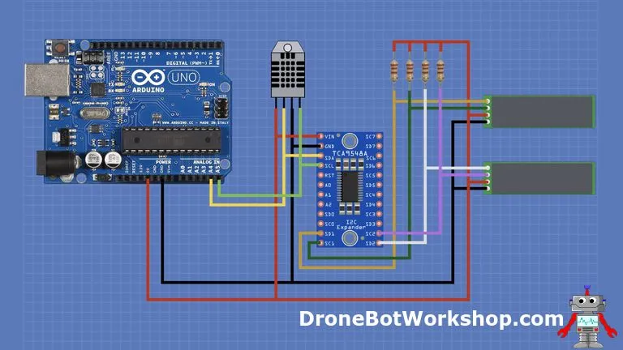
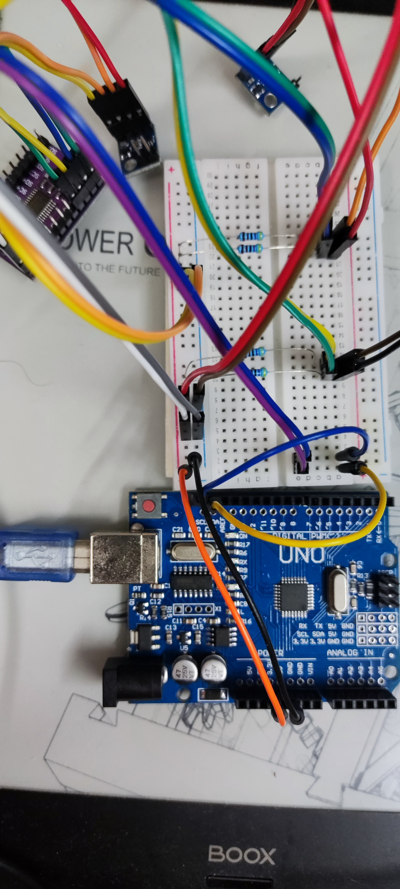

# Table of Contents

1.  [I2C 地址冲突](#orge2689f7)
2.  [硬件解决方法](#org186e267)
3.  [TCA9548A I2C Multiplexer Module](#orga9eaf0e)
4.  [Ardunio Code](#org4ee32d5)

Multiple I2C Buses with an Arduino Using TCA9548A

# I2C 地址冲突

Here is an example of an I2C address conflict:

The two I2C slaves have the same address, which is not going to work. At least, most of the time.
It’s a basic rule of I2C – every slave device needs to have a unique address.

# 硬件解决方法

To be more specific, an I2C Multiplexer that connects to several external I2C busses. When we wish to communicate with a slave device wwe switch to the bus that contains the slave and address it.
Each bus needs to obey the same rules as any I2C bus of course, so slaves can’t have conflicting addresses on individual buses. But as long as you keep your similarly-addressed slaves on different busses you’ll be fine.

# TCA9548A I2C Multiplexer Module

接入Arduino
Here is how we will hook everything up:

Note the use of pullup resistors on the display side. They aren’t required on the Arduino side as the TCA9548A has internal 10K pullup resistors on it’s input, but none on any of its outputs.
You can buy TCA9548A modules from other manufactures that do have strappable pullup resistors on the output channels. Since this module does not have them I used 2.2k pullups, but any value from 2.2 to 20K will work well.

# Ardunio Code
    #include <VL53L0X.h>
    
    #include <Wire.h>
    extern "C" {
    #include <utility/twi.h>
    }
    
    VL53L0X sensor;
    uint8_t i2c_devices = 0;
    #define TCAADDR 0x70
    
    void tcaselect(uint8_t i) {
      if (i > 7) return;
      Wire.beginTransmission(TCAADDR);
      Wire.write(1 << i);
      Wire.endTransmission();
    }
    
    void setup() {
      while (!Serial)
        ;
      Wire.begin();
      Serial.begin(9600);
      Serial.println("\nTCA9548A Scanner ready!");
    
      for (uint8_t c = 0; c < 8; ++c) {
        tcaselect(c);
        Serial.print("TCA Port #");
        Serial.println(c);
        for (uint8_t addr = 0; addr <= 127; addr++) {
          if (addr == TCAADDR) continue;
          uint8_t data;
          if (!twi_writeTo(addr, &data, 0, 1, 1)) {
    	Serial.print("Found I2C 0x");
    	Serial.println(addr, HEX);
    	i2c_devices |= (1 << c);
          }
        }
      }
    
      Serial.println("done!");
      delay(2000);
      tcaselect(0);
      sensor.setTimeout(500);
      if (!sensor.init()) {
        Serial.println("Не удалось обнаружить и инициализировать датчик!");
        while (1) {}
      }
      Serial.println(i2c_devices, BIN);
    }
    
    void loop() {
    
    }

